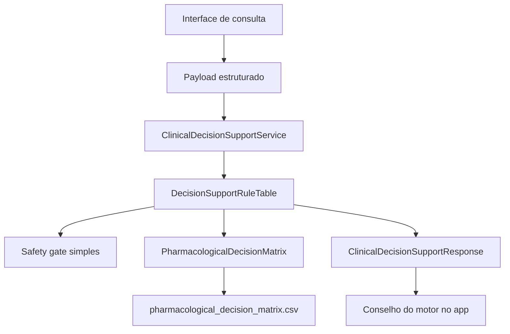
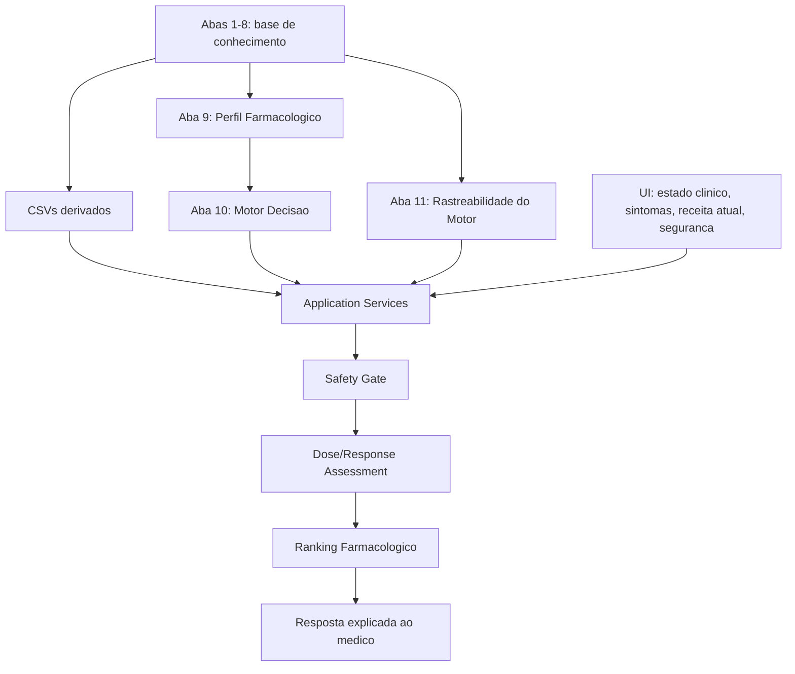

# Auditoria de Evolucao do Motor Farmacologico

Status: auditoria arquitetural  
Data: 2026-07-11  
Escopo: Motor Farmacologico / Decision Support Engine  
Regra: sem alteracao de codigo, sem alteracao de planilhas, sem mudanca de comportamento do app

## 1. Estado Atual

O PsychRx ja possui uma base funcional para suporte a decisao farmacologica local. A arquitetura atual esta dividida em tres camadas praticas:

1. Base de conhecimento visual e curada nas abas da planilha.
2. Tabelas CSV estruturadas usadas pelo app.
3. Servico de aplicacao que transforma o estado da consulta em resposta exibivel.

### Abas existentes na planilha unificada

| Aba | Responsabilidade atual | Uso pelo motor |
| --- | --- | --- |
| Tabela 1 - Matriz Antidepressiv | Matriz visual de antidepressivos por indicacao, prioridade, dose e primeira escolha. | Parcialmente consumida por CSVs derivados: indicacao, prioridade e primeira escolha. |
| Tabela 2 - Antidepressivos | Dados praticos de antidepressivos: apetite, libido, meia-vida, horario, apresentacoes, alvos, contraindicacoes e acao. | Parcialmente consolidada em matrizes e na matriz farmacologica. |
| Tabela 3 - Antipsicoticos Tipic | Antipsicoticos tipicos, potencia, meia-vida, apresentacoes, indicacoes e contras. | Ainda pouco consumida pelo ranking. |
| Tabela 4 - Seguranca Manejo | Regras de seguranca e manejo para antipsicoticos. | Conceitualmente alinhada ao safety gate, mas ainda nao conectada de modo completo. |
| Tabela 5 - Atipicos | Antipsicoticos atipicos, alvos, indicacoes, contras e acao. | Parcialmente consolidada na matriz farmacologica. |
| Tabela 6 - Principios | Principios clinicos de antipsicoticos e manejo. | Ainda mais documental do que computacional. |
| Tabela 7 - Atipicos Continuacao | Continuacao de atipicos/estabilizadores e dados associados. | Parcialmente consolidada na matriz farmacologica. |
| Tabela 8 - Estabilizadores | Estabilizadores de humor e regras de classe. | Parcialmente consolidada na matriz farmacologica. |
| Aba 9 - Perfil Farmacologico | Mapeia campos clinicos para eixos do motor. | Serve como especificacao conceitual do perfil desejado. |
| Aba 10 - Motor Decisao | Matriz de ranking por eixos farmacologicos e cautelas. | Consumida indiretamente pelo CSV `pharmacological_decision_matrix.csv`. |

### Tabelas CSV atuais

| Arquivo | Responsabilidade |
| --- | --- |
| `pharmacological_decision_matrix.csv` | Ranking farmacologico por eixos: energia, ansiedade, sono, dor, peso, libido, estabilizacao, psicose e impulsividade. |
| `decision_rules.csv` | Define familias de acao conforme seguranca, estabilidade, medicacao atual, resposta e tolerabilidade. |
| `medication_strategy_table.csv` | Tabela menor com candidatos, faixa usual, cautelas e fonte. |
| `question_derivation_matrix.csv` | Campos e perguntas que devem emergir do motor. |
| `safety_gate_questions.csv` | Perguntas de seguranca que devem vir antes da estrategia. |
| `antidepressant_*_matrix_table1.csv` | Derivacoes estruturadas da Tabela 1. |

### Fluxo atual



### Informacoes produzidas e consumidas

Consumidas hoje:

- apresentacao clinica;
- sintomas;
- prejuizo/objetivo;
- perfil farmacologico desejado;
- restricoes/comorbidades;
- safety basico;
- medicacoes atuais quando enviadas ao backend.

Pouco ou nada consumidas hoje:

- dose atual numerica;
- unidade e frequencia;
- formulacao;
- tempo de uso;
- beneficio percebido;
- tolerabilidade detalhada;
- motivo original da prescricao;
- historico de tentativas anteriores;
- distancia entre dose atual e faixa terapeutica;
- nivel de evidencia por regra;
- pagina/secao/documento especifico de cada regra;
- varias informacoes das abas 3, 4, 6, 7 e 8.

### Duplicacao

Existe duplicacao controlada e aceitavel entre:

- planilhas visuais originais;
- CSVs derivados;
- matriz farmacologica.

Essa duplicacao e aceitavel porque as abas 1-8 sao fonte visual curada, enquanto os CSVs sao artefatos executaveis. O risco aparece quando uma informacao muda na planilha e nao e propagada para o CSV correspondente.

### Lacunas

As maiores lacunas sao:

1. A dose atual ainda nao participa de forma forte no calculo.
2. A resposta ao tratamento e tolerabilidade ainda nao modulam suficientemente o ranking.
3. O safety gate atual bloqueia poucos itens e nao tem granularidade suficiente.
4. A rastreabilidade ainda aponta para tabela local, mas nao para documento, secao, pagina e status de validacao.
5. O resultado do motor mostra ranking, mas ainda nao explica distancia ate alvo terapeutico nem adequacao da dose atual.

## 2. Perfil Farmacologico Desejado

O conceito de perfil farmacologico desejado deve permanecer como camada propria.

Recomendacao: preservar a Aba 9 como especificacao do perfil e expandi-la de forma incremental, sem misturar com a Aba 10.

### Eixos recomendados

| Eixo | Status atual | Evolucao recomendada |
| --- | --- | --- |
| ansiedade | presente | manter e vincular a sintomas TAG/panico/TOC/trauma |
| depressao/humor | parcial | separar humor deprimido, anedonia, apatia e recaida |
| energia | presente | manter e conectar a fadiga, apatia, anedonia |
| sono | presente | separar inicio, manutencao, terminal e sonolencia diurna |
| dor | presente | manter e conectar a prejuizo somatico |
| cognicao | ausente como eixo dedicado | criar eixo `fit_cognition` |
| impulsividade | presente | manter e conectar a agitacao/uso de substancias |
| psicose | presente | manter e conectar a antipsicoticos |
| humor bipolar | presente como estabilizacao | manter e separar depressao bipolar vs elevacao |
| libido | presente | manter e conectar a restricao sexual |
| peso/metabolico | presente | manter e conectar a obesidade/diabetes |
| sedacao | misturado com sono | separar sedacao desejada de sedacao indesejada |
| ativacao | parcial | criar eixo especifico para ativacao/risco de piora ansiosa |

### Como integrar sem retrabalho

Manter:

- `pharmacological_decision_matrix.csv` como matriz executavel.
- Aba 9 como dicionario de eixos.
- `PharmacologicalDecisionMatrix` como motor de score.

Evoluir:

- adicionar novos eixos somente quando houver coluna correspondente na matriz;
- criar tradutor unico de termos clinicos para eixos;
- impedir que a UI tenha regras proprias de mapeamento clinico complexas.

## 3. Medicacao Atual

A estrutura atual ja possui `CurrentMedicationPayload` com:

- nome;
- dose;
- unidade;
- frequencia;
- duracao;
- adesao;
- resposta;
- tolerabilidade.

O problema nao e ausencia de contrato. O problema e uso incompleto desse contrato pelo motor.

### Ponto correto de entrada

A medicacao atual deve entrar antes do ranking final, em tres momentos:

1. Excluir ou penalizar o mesmo medicamento no ranking.
2. Avaliar se a dose atual esta abaixo, dentro ou acima da faixa cadastrada.
3. Modular a estrategia: manter, otimizar, substituir, associar ou investigar.

### Reuso da estrutura atual

Recomendacao:

- manter `CurrentMedicationPayload`;
- expandir apenas a interpretacao em application layer;
- criar uma pequena camada futura chamada `CurrentMedicationAssessment`, sem alterar o contrato publico inicialmente.

Campos que devem ser calculados:

- `current_dose_status`: abaixo / dentro / acima / desconhecida;
- `duration_status`: tempo insuficiente / adequado / desconhecido;
- `response_status`: boa / parcial / sem resposta / piora;
- `tolerability_status`: boa / leve / moderada / ruim;
- `optimization_possible`: sim / nao / indeterminado.

## 4. Alvo Terapeutico

Hoje o motor retorna `PharmacologicalTargetPayload`, que ja possui:

- dominio de prejuizo;
- sintoma-alvo;
- alvo farmacologico;
- faixa/dose terapeutica;
- fonte da dose;
- marcador de pendencia.

Essa estrutura deve ser preservada.

### Evolucao necessaria

Sem duplicar informacoes, o resultado final deve passar a informar:

- dose atual informada;
- faixa terapeutica cadastrada;
- distancia ate o alvo;
- tempo de uso suficiente ou insuficiente;
- adequacao da dose para a acao proposta.

Recomendacao arquitetural:

```text
CurrentMedicationPayload
        ↓
MedicationDoseAssessment
        ↓
PharmacologicalTargetPayload
        ↓
ClinicalDecisionSupportResponse
```

Isso evita criar dose solta no ranking. A dose deve explicar a estrategia, nao substituir o score farmacologico.

## 5. Questionario de Risco

O projeto ja possui `safety_gate_questions.csv` e `ClinicalSafetyPayload`, mas eles ainda nao cobrem toda a complexidade desejada.

### Perguntas que devem entrar

- bipolaridade / mania / hipomania;
- gestacao / lactacao;
- epilepsia / risco convulsivo;
- glaucoma;
- doenca renal;
- doenca hepatica;
- risco metabolico;
- prolongamento de QT;
- interacoes;
- risco suicida;
- abuso de substancias;
- parkinsonismo/EPS quando antipsicotico entrar;
- risco de quedas/sedacao em idosos.

### Bloquear ou alterar score?

Separar em tres classes:

| Tipo | Comportamento |
| --- | --- |
| Bloqueio duro | suicidio ativo nao avaliado, mania ativa sem trilha adequada, gestacao para itens contraindicados, interacao grave, alergia/contraindicacao absoluta. |
| Penalizacao forte | obesidade/diabetes para alto risco metabolico, QT para medicamentos com cautela QT, epilepsia para bupropiona, renal/hepatico para itens dependentes. |
| Pergunta derivada | item ainda nao avaliado, cautela moderada, necessidade de monitorizacao. |

Recomendacao: o safety gate deve decidir primeiro se ha bloqueio. Depois a matriz de ranking aplica penalizacoes.

## 6. Fontes e Rastreabilidade

Hoje existe rastreabilidade local por:

- source ID;
- titulo;
- secao;
- aba/tabela local;
- status local.

Isso e suficiente para desenvolvimento, mas insuficiente para maturidade cientifica.

### Campos recomendados

Sem alterar a estrutura principal, adicionar futuramente campos opcionais:

- `source_document`;
- `source_section`;
- `source_page`;
- `source_url`;
- `source_date`;
- `validation_status`;
- `evidence_level`;
- `reviewer`;
- `last_reviewed_at`;
- `traceability_status`.

### Menor caminho

Criar futuramente uma tabela complementar:

```text
pharmacological_decision_matrix_sources.csv
```

Ela se relacionaria com `drug_id + eixo + regra`, sem poluir a matriz principal.

## 7. Resultado do Motor

A resposta atual ja contem:

- resumo;
- acao recomendada;
- racional clinico;
- alvos de prejuizo;
- alvos farmacologicos;
- opcoes de substituicao;
- opcoes de associacao;
- evidencia da acao;
- alternativas rejeitadas;
- warnings de seguranca;
- monitorizacao;
- confianca;
- limite de prescricao.

### O que falta ampliar

Adicionar sem perder simplicidade:

- perfil farmacologico solicitado;
- medicamentos atuais analisados;
- adequacao da dose atual;
- alvo terapeutico por medicamento;
- riscos encontrados e seu efeito no score;
- ranking final com score bruto, penalizacoes e score final;
- explicacao curta por candidato;
- fontes por eixo do score.

### Proposta de resposta final

```text
1. Direcao sugerida
2. Perfil farmacologico solicitado
3. Receita atual analisada
4. Adequacao da dose atual
5. Ranking farmacologico
6. Motivos do ranking
7. Riscos/cautelas que alteraram a pontuacao
8. Fontes usadas
9. Proximas perguntas necessarias
10. Limite: decisao final do medico
```

## 8. Nova Arquitetura Recomendada

Nao recomendo refatorar do zero.

Recomendo preservar:

- as oito abas originais;
- a Aba 9 como especificacao do perfil;
- a Aba 10 como matriz executavel;
- os contratos atuais;
- `ClinicalDecisionSupportService`;
- `DecisionSupportRuleTable`;
- `PharmacologicalDecisionMatrix`.

### Criar nova aba integradora ou expandir existente?

Resposta: criar uma nova aba integradora somente para rastreabilidade e calculo avancado.

Justificativa:

- Expandir a Aba 10 demais transformaria a matriz de ranking em deposito de fontes, regras, dose e historico.
- A Aba 10 deve permanecer enxuta e computavel.
- A nova aba deve servir como ponte entre score, fonte e regra.

Proposta:

```text
Aba 11 - Rastreabilidade do Motor
```

Responsabilidade:

- relacionar `drug_id`;
- eixo;
- regra;
- origem;
- documento;
- secao;
- pagina;
- status de validacao;
- observacao editorial.

### Diagrama proposto



## 9. Sequencia de Processamento Recomendada

```text
1. Capturar estado clinico atual
2. Capturar sintomas e prejuizo funcional
3. Capturar receita atual
4. Fechar safety gate
5. Calcular perfil farmacologico desejado
6. Avaliar dose/tempo/resposta/tolerabilidade da medicacao atual
7. Pontuar candidatos pela matriz farmacologica
8. Aplicar bloqueios e penalizacoes de risco
9. Anexar rastreabilidade
10. Montar ranking final
11. Explicar motivos e proximas perguntas
12. Exibir limite: decisao final do medico
```

## Pontos Fortes

- O projeto ja tem estrutura local, sem dependencia obrigatoria de GPT.
- A resposta ja usa contrato estruturado.
- O app ja tem fluxo progressivo.
- A matriz de decisao ja transforma perfil em ranking.
- A separacao entre knowledge base visual e CSV executavel esta correta.
- O safety gate ja existe conceitualmente.

## Pontos que Devem Permanecer Inalterados

- As oito abas originais como base de conhecimento curada.
- A separacao entre UI, service, rule table e matrix.
- O contrato `ClinicalDecisionSupportResponse`.
- A proibicao de resposta autonoma sem revisao medica.
- A ideia de ranking justificado em vez de prescricao automatica.

## Pontos que Devem Evoluir

1. Completar uso da medicacao atual.
2. Criar avaliacao de dose/tempo/resposta/tolerabilidade.
3. Expandir safety gate para bloqueios e penalizacoes.
4. Criar rastreabilidade granular.
5. Separar sedacao desejada de sedacao indesejada.
6. Criar eixo de cognicao.
7. Melhorar traducao e padronizacao dos textos exibidos ao medico.
8. Garantir que toda informacao visual importante das abas 3-8 entre no motor quando pertinente.

## Riscos da Evolucao

| Risco | Mitigacao |
| --- | --- |
| Misturar tabela visual e tabela executavel | Manter abas 1-8 intactas e derivar CSVs. |
| Transformar ranking em prescricao | Manter boundary de suporte a decisao e revisao medica. |
| Perder rastreabilidade | Criar Aba 11 / CSV de fontes por eixo. |
| Crescer demais a matriz | Separar ranking, dose, safety e fontes em tabelas auxiliares. |
| Resposta ficar longa demais | UI deve mostrar resumo primeiro e detalhes em blocos expansivos. |

## Plano de Migracao sem Retrabalho

### Fase 1 - Auditoria e consolidacao

- Manter arquitetura atual.
- Corrigir apenas problemas de texto/encoding quando autorizado.
- Documentar mapeamento das abas para campos do motor.

### Fase 2 - Medicacao atual

- Usar `CurrentMedicationPayload` ja existente.
- Criar avaliacao de dose, tempo, resposta e tolerabilidade.
- Mostrar adequacao da dose atual na resposta.

### Fase 3 - Safety gate ampliado

- Expandir `safety_gate_questions.csv`.
- Classificar risco como bloqueio, penalizacao ou pergunta derivada.
- Aplicar penalizacoes antes do ranking final.

### Fase 4 - Rastreabilidade

- Criar `pharmacological_decision_matrix_sources.csv` ou Aba 11.
- Ligar cada eixo de score a fonte, secao, pagina e status.

### Fase 5 - Resultado final

- Ampliar resposta com score bruto, penalizacoes, score final e fontes.
- Manter tela simples: ranking primeiro, detalhes depois.

## Conclusao

O trabalho atual esta correto e deve ser preservado. A evolucao nao deve comecar por refatoracao ampla. O melhor caminho e adicionar camadas pequenas ao redor da matriz atual:

1. avaliacao da medicacao atual;
2. safety gate ampliado;
3. rastreabilidade granular;
4. explicacao final mais rica.

A recomendacao principal e manter a Aba 10 como motor de ranking e criar uma nova camada complementar de rastreabilidade, em vez de transformar a matriz executavel em uma tabela gigante e dificil de manter.
